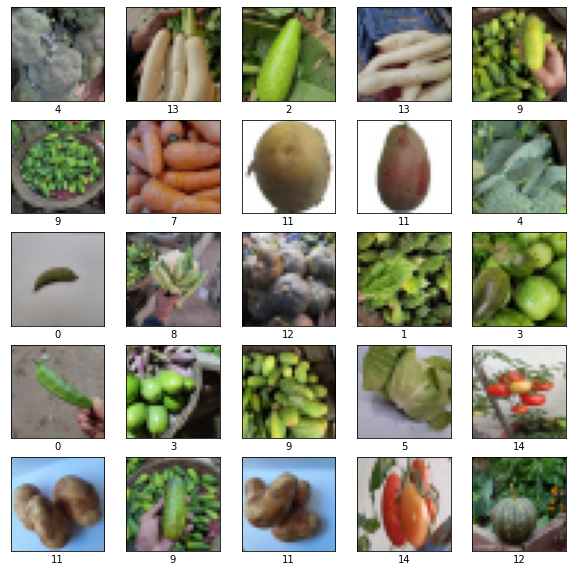

# Vegetable-Classification
This project uses Image Classification to identify different types of vegetables.

## Dataset
The dataset is aquired online. It was added to the website <b>Kaggle</b> by the user <b>M Israk Ahmed</b>:

<a>https://www.kaggle.com/datasets/misrakahmed/vegetable-image-dataset</a>

For presentation reasons, the <b>Vegetable Images</b> folder included with this repository contains only a very limited number of images; it showcases the way the dataset is structured.

## Model

## Training

## Testing

