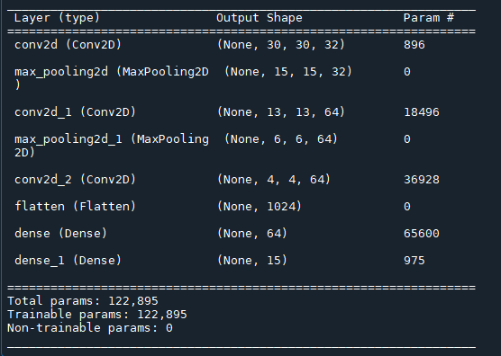
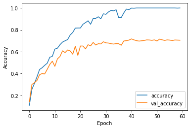

# Vegetable-Classification
This project uses Image Classification to identify different types of vegetables.

## Dataset
The dataset is aquired online. It was added to the website <b>Kaggle</b> by the user <b>M Israk Ahmed</b>:

<a>https://www.kaggle.com/datasets/misrakahmed/vegetable-image-dataset</a>

For presentation reasons, the <b>Vegetable Images</b> folder included with this repository contains only a very limited number of images; it showcases the way the dataset is structured.

## Model

The <b>Neural Network</b> model was created to be a simple convolutional one. On its base it contain <b>3 convolutional layers</b> and <b>2 max pooling layers</b>.

## Testing
Because of the nature of the project, it was trained for 60 epochs; the metrics started giving relatively acceptable results.

